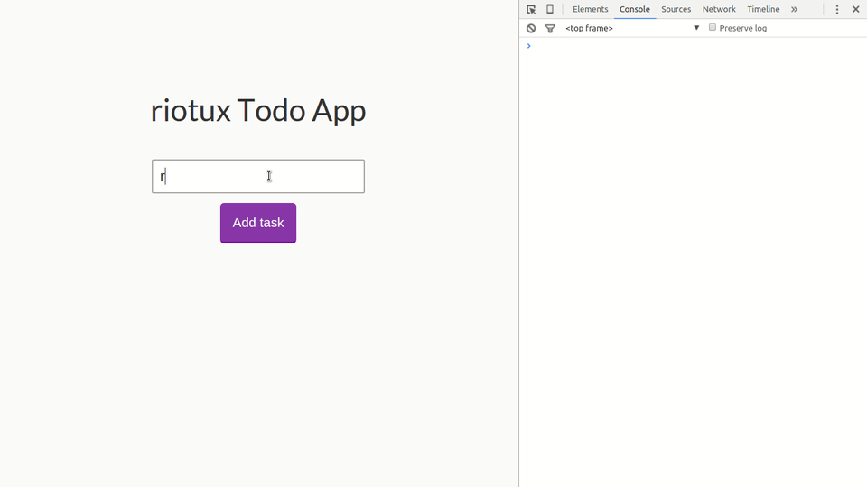

# riotux  [](https://www.npmjs.com/package/riotux)
> A centralized state management inspired in Flux and Redux.

## Intro 
**riotux** is a centralized state management for Javascript applications. It is inspired by Flux and Redux, but with simplified concepts.

<p align="center">
  
</p>

### Examples:
<a href="https://github.com/luisvinicius167/riotux-todo"> Todo app example + guide </a><br>

### Install
* Npm: ``` npm install riotux ```
* Bower: ``` bower install riotux ```
* Cdn: ``` https://cdnjs.cloudflare.com/ajax/libs/riotux/1.0.5/riotux.min.js ```

### Why you need riotux?
If your app is simple enough, you probably don't need riotux. Don't apply it prematurely. But if you are building a medium-to-large-scale SPA, chances are you have run into situations that make you think about how to better structure things outside of your Riot components. This is where riotux comes into play.

### Data Flow
In riotux data flow is unidirectional, as it should be in Flux:

* The component triggers action calls;
* Actions dispatch mutations that change the state;
* Changes in state flow from the store back into the component via riotux obervables.

### Principles:
* Application state is held in the store, as a single object. 
* The only way to mutate the state is by dispatching mutations on the store.
* Mutations must be synchronous, and the only side effects they produce should be mutating the state.

### Store: 
The **store** is basically a container that holds your application state. There are two things that makes a riotux store different:

 * The store are **reactive**. Your component can observe changes in the store state, and when the state is changed, your component will be updated.
 
 * You cannot directly mutate the store's **state**. The only way to change a store's state is by explicitly dispatching mutations.

Creating a riotux store is pretty straightforward - just provide an initial state object, and some mutations:

```javascript
var store = riotux.Store({
  state: {
    count: 1,
    title: 'riotux is nice!'
  },
  mutations: {  
    increment: function ( state ) {
      state.count += 1; 
    },
    changeTitle: function ( state, newTitle ) {
      state.title = newTitle;
    }
  }
});
```

#### State
Application state is held in the store, as a single object. **riotux** uses a single state tree - that is, this single object contains all your application level state and serves as the "single source of truth". This also means usually you will have only one store for each application.

#### Observe state changes in your Component
When some state change in your store, all components that will listening the changed state will be updated. You just use ``` riotux.subscribe(component, state, [...states]) ```. When your component will **unmount**, you can unsubscribe for states changes: ``` riotux.subscribe(component) ```.

```html
<!-- in your component -->
  <h1> Count: { count } </h1>
  <script>
    riotux.subscribe(this, 'count');

    this.on('update', function ( ) {
      self.count = riotux.getter('count'); // get the count state value
    });

    this.on('unmount', function ( ) {
      riotux.unsubscribe(this); // Unsubscribe the observe states
    });
  </script>
```

#### Mutations
The mutations are essentially events: each mutation has a name and a callback. In riotux the callback function will receive the state as the first argument:

```javascript
var store = riotux.Store({
  state: {
    count: 1,
  },
  mutations: {  
    increment: function ( state ) {
      state.count += 1;
    }
  }
});
```

You cannot directly call a mutation callback. When an increment event is dispatched, the callback is triggered. To invoke a mutation callback, you need to dispatch a mutation event:

```javascript
  store.dispatch('increment');
```

#### Dispatch with Arguments

```javascript
var store = riotux.Store({
  state: {
    count: 1,
  },
  mutations: {  
    increment: function ( state, value ) {
      state.count += value;
    }
  }
});
```

```javascript
  store.dispatch('increment', 2); //  log-> 3;
```
### Actions
Actions are just functions that dispatch mutations. The actions will be called from components.

Creating an action:

```javascript
var action = riotux.Actions({
  add: function ( number ) {
    store.dispatch('increment', number);
    // if you don't have a store instance in your application
    // riotux.store.dispatch('increment', 1);
  }
}); 
```
#### Calling an action on your component

```javascript
  riotux.action('count', 'increment', 10);
```

The ```action``` recieves the **state** that you wants to change as first argument, the ***mutation event name** as the second argument and the values you nedd to pass like arguments to the mutation callback.

### Getter
If you want to get the state value, use ```riotux.getter(sate_name)```.

### Application Structure
Just suggesting.

```project
├──index.html
├──components
|   ├──component.tag
|   ├──other.tag
├──riotux
|   ├──store.js
|   ├──action.js
```

### License
MIT License.
