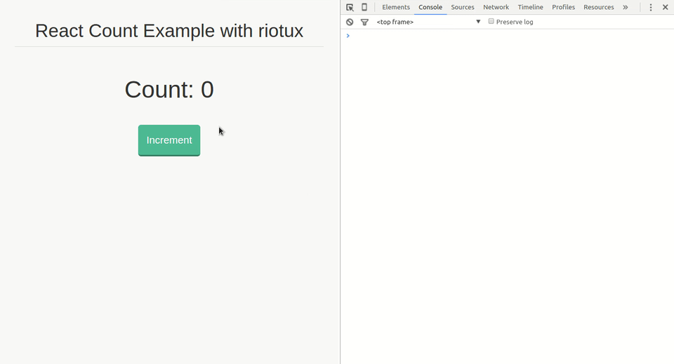

# riotux <br/>
[](https://www.npmjs.com/package/riotux) [](https://gitter.im/luisvinicius167/riotux)
> A reactive centralized state management for Javascript Apps.

## Intro
**riotux** is a reactive centralized state management for Javascript applications. It is inspired by Flux and Redux, but with simplified concepts.

```
╔═════════╗       ╔═══════════╗       ╔═══════════╗       ╔═════════════════╗
║ Actions ║──────>║ Mutations ║ ────> ║   State   ║ ────> ║ View Components ║
╚═════════╝       ╚═══════════╝       ╚═══════════╝       ╚═════════════════╝
     ^                                                            │
     └────────────────────────────────────────────────────────────┘

```

<p align="center">
  
</p>

### Examples:
<a href="https://github.com/luisvinicius167/riotux-react-count"> React.js count app example + guide </a><br>
<a href="https://github.com/luisvinicius167/riotux-todo"> Riot.js Todo app example + guide </a><br>
<a href="https://github.com/luisvinicius167/mithril-riotux-count/"> Mithril.js Count app example + guide </a><br>

### Install
* Npm: ``` npm install riotux ```
* Bower: ``` bower install riotux ```
* Cdn: ``` <script src="https://cdnjs.cloudflare.com/ajax/libs/riotux/1.0.6/riotux.min.js"></script> ```

### Why riotux?
* Tiny size: ~1.3kb
* Simple and minimalistic API
* Single state tree
* Reactive
* Unidirectional data flow

### Data Flow
In riotux data flow is unidirectional, as it should be in Flux:

* The component triggers action calls.
* Actions dispatch mutations that change the state.
* Changes in state flow from the store back into the component via handler.

### Principles:
* Application state is held in the store, as a single object.
* The only way to mutate the state is by dispatching mutations on the store.
* Mutations must be synchronous, and the only side effects they produce should be mutating the state.

### Store:
A **Store** is basically a container that holds your application state. There are two things that makes a __riotux__ store different:

 * A Store are **reactive**. Your Component can observe changes in the store's state, and when the state is changed, your component will be notified.

 * You cannot directly mutate the store's **state**. The only way to change a store's state is by explicitly dispatching mutations.

Creating a riotux Store is pretty straightforward - just provide an initial state object, and some mutations:

```javascript
var store = riotux.Store({
  state: {
    count: 1,
    title: 'riotux is nice!'
  },
  mutations: {  
    increment: function ( state ) {
      state.count += 1;
    },
    changeTitle: function ( state, newTitle ) {
      state.title = newTitle;
    }
  }
});
```

#### State
Application state is held in the store, as a single object. **riotux** uses a **single state tree** - that is, this single object contains all your application level state and serves as the *"single source of truth"*. This also means usually you will have only one Store for each application.

#### Observe state changes in your Component
> When some state change in your store, your handler function will called.

In your **Component** you just use ``` riotux.subscribe(component, [states], handler) ```. In your handler function, you can update your component. **Your handler receives two arguments: the name of the state that was changed and the new state value.**

Alternately, you could unsubscribe for state changes, for example, when unmounting
a component.

```html
<!-- In this example, a Riot Component -->
  <h1> Count: { count } </h1>
  <script>
    var self = this;
    riotux.subscribe(this, 'count', function ( state, state_value ) {
      // the state changed, than update the component
      self.update();
    });

    this.on('update', function ( ) {
      self.count = riotux.get('count'); // recieves the new state value
    });

    this.on('unmount', function ( ) {
      riotux.unsubscribe(this); // Unsubscribe the observe states
    });
  </script>
```

#### Mutations
The mutations are essentially events, each mutation has a name and a callback. In riotux, the mutation function always receives the Store state as the first argument:

```javascript
var store = riotux.Store({
  state: {
    count: 1,
  },
  mutations: {  
    increment: function ( state ) {
      state.count += 1;
    }
  }
});
```

#### Dispatch with Arguments

```javascript
var store = riotux.Store({
  state: {
    count: 1,
  },
  mutations: {  
    increment: function ( state, value ) {
      state.count += value;
    }
  }
});
```

> You cannot directly call a mutation callback. When an increment event is dispatched, the callback is triggered. To invoke a mutation callback, you need to call an action.

### Actions
Actions are just functions that dispatch mutations. **All actions receive a store as first argument**. The actions are called from components.

Creating an action:

```javascript
var action = riotux.Actions({
  add: function ( store, number ) {
    store.dispatch('increment', number);
  }
});
```
#### Calling an action on your component

```javascript
  riotux.action('count', 'add', 10);
```

An ```action``` receives the **state** property that you want to change as first argument, the ***mutation event name** as the second argument, anything after these are passed as arguments to the mutation callback.

### Get
To get the state value, use ```riotux.get( stateName )``` in your Components.

### Application Structure
Just suggesting.

```project
├──index.html
├──components
|   ├──component.tag
|   ├──other.tag
├──riotux
|   ├──store.js
|   ├──action.js
```

### API Reference

* #### Store:
  * ``` riotux.Store({ state, mutations }) ```: Create a single store with the state of your application and the mutations functions.

* #### Actions:
  * ``` riotux.Actions({}) ```: Creates all actions of your application.

* #### Component:
  * ``` riotux.subscribe(component, [states], handler( state_name, value )) ```: Subscribe your component to observe state changes. Every time the state changes, the corresponding handler function will called. In most cases, you would update your component in this handler. The ``` handler ``` receives as the first argument, the state name that was changed and the value of the state as second argument.

  * ``` riotux.unsubscribe(component) ```: Unsubscribe your component. Your component stops observing state changes.

  * ``` riotux.action('state', 'event_name' [,args]) ```: Trigger the action that invokes the corresponding mutation store function. The ``` state ``` is the name of state that you wants to change. ``` event_name ``` is the mutation function name. Arguments can be passed after the ``` event_name ```.

  * ``` riotux.get(state) ```: Gets a value of the state that you passed as argument.


### License
MIT License.
